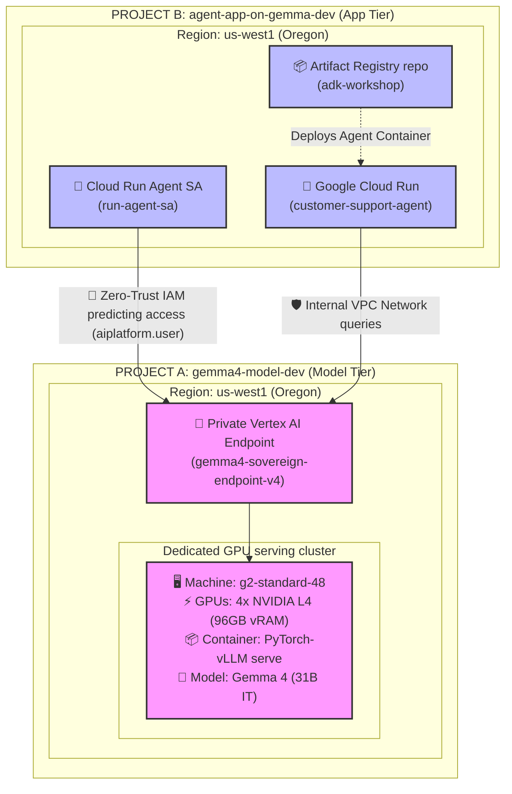

# 🚀 ADK Multi-Agent POC — Customer Support Triage with Gemma 4

A workshop POC demonstrating a multi-agent customer support system built with [Google ADK (Python)](https://google.github.io/adk-docs/) and Gemma 4 via Google AI Studio or a securely hosted Vertex AI private sovereign inference endpoint.

---

## 🏗️ Architecture

```
User
 └── triage_agent  (router)
       ├── billing_agent   — payments, invoices, subscriptions, refunds (equipped with parse_billing_document vision tool)
       ├── tech_agent      — bugs, errors, API issues, troubleshooting
       └── general_agent   — account access, policies, general queries
```

---

## 📋 Project Structure

```
.
├── pyproject.toml       # Project dependencies & configuration
├── .env.example         # Environment template
├── distill_gemma4.py    # Model distillation pipeline launch script
├── customer_support/    # Multi-agent logic folder
│   ├── __init__.py
│   ├── config.py        # API keys & Model definitions
│   ├── agent.py         # Main Agent orchestrator & strict routing callback
│   └── sub_agents/      # Individual specialist agents (billing, tech, general)
└── tests/               # Unit tests for routing verification
```

---

## 📋 Prerequisites & Setup

**1. Install dependencies**
Activate your virtual environment and install the local package in editable mode:
```bash
source .venv/bin/activate
pip install -e .
```

**2. Configure environment variables**
Copy the example environment file:
```bash
cp .env.example .env
```
* By default (Google AI Studio mode), edit `.env` and add your `GOOGLE_API_KEY` from [Google AI Studio](https://aistudio.google.com/apikey).
* For Private Sovereign Vertex AI endpoint mode, see the **Live GCP Deployment** section below.

---

## 💻 1. Running CLI Mode (`adk run`)

The ADK CLI allows you to execute single-step queries directly from your terminal. It will initialize the `triage_agent`, route your query using the `gemma-4-31b-it` model, and perform the appropriate agent transfer:

```bash
# Test Billing Routing
adk run customer_support "I was charged twice this month, can you help?"

# Test Technical Troubleshooting Routing
adk run customer_support "I am getting a 500 error when calling your API"

# Test General Support Routing
adk run customer_support "How do I reset my password?"
```

You should see the decision trace from `[triage_agent]` ending in a structured JSON transfer command, e.g.:
```json
{"name": "transfer_to_agent", "parameters": {"agent_name": "billing_agent"}}
```

### Try these sample prompts:

| Specialist | Sample message | Expected Handoff |
|---|---|---|
| **Billing** | "I was charged twice this month, can you help?" | `billing_agent` |
| **Technical** | "I'm getting a 500 error when calling your API" | `tech_agent` |
| **General** | "How do I reset my password?" | `general_agent` |

---

## 🌐 2. Running Interactive Web UI (`adk web`)

The ADK Web UI provides a premium, rich-featured interface to chat with your agents, create evaluation datasets, and visualize execution traces and logic graphs.

### Start the Web Server
Run the web server by pointing ADK to your current workspace folder:

```bash
# Start the web server on default port 8000
adk web .
```

*If you want to run on a custom port (e.g., 8080) or enable debug logs:*
```bash
adk web . --port 8080 --verbose
```

### How to Test in the Browser
1. Open your browser and navigate to: **[http://127.0.0.1:8000](http://127.0.0.1:8000)**
2. In the top-left dropdown, select the **`triage_agent`**.
3. Type any of the sample queries in the chat window.
4. **Explore the Trace View**:
   * Click on the **Trace** tab in the UI.
   * Inspect execution flows, request/response structures, and generated routing events.
   * Inspect the blue-highlighted event rows that represent ADK agent-to-agent transfers.

---

## ☁️ 3. Live Cross-Project GCP Sandbox Deployment

For production-grade environments (e.g., workshop showcases), you can deploy the **Gemma 4 Inference Model** in one secure GCP sandbox project, and the **ADK Application Orchestrator** in another project.

### 📐 Multi-Project Zero-Trust Architecture Diagram



---

### 🗂️ Step 3.1: Active CLI Session Setup
Ensure you are authenticated inside your GCP Argolis sandbox and configure your active terminal variables with your exact Project IDs:

```bash
# 1. Authenticate with Google Cloud SDK and Application Default Credentials (ADC)
gcloud auth login
gcloud auth application-default login

# 2. Configure project variables
export MODEL_PROJECT_ID="gemma4-model-dev"
export APP_PROJECT_ID="agent-app-on-gemma-dev"

# 3. Verify sandbox projects are reachable
gcloud projects describe $MODEL_PROJECT_ID
gcloud projects describe $APP_PROJECT_ID
```

### 🛠️ Sovereign Infrastructure-as-Code Deployment (Terraform)

This standard enterprise-grade deployment workflow fully automates the API enablement, service account creation, cross-project permission grants, VPC endpoints, and private model container registry provisioning.

#### Step 3.2: Initialize the Terraform directory
```bash
# Navigate to your Terraform directory
cd terraform

# Initialize providers
terraform init
```

#### Step 3.3: Deploy the entire stack
```bash
# Preview deployment blueprint plan
terraform plan

# Deploy model, VPC prediction endpoints, and IAM bindings!
terraform apply
```

> [!IMPORTANT]
> **Terraform Lifecycle Hand-off Note (If Endpoint Already Exists):**
> In Terraform, custom scripts (`local-exec` provisioner blocks) are **creation-time provisioners**—they only run once during the very first deployment.
> If the `google_vertex_ai_endpoint` was successfully created on a prior run, subsequent `terraform apply` runs will report `No changes` and skip model container registration/deployment.
> 
> If your endpoint exists but does not have the custom model container active, resolve this using:
> 
> * **Method A: Manual CLI Trigger (Recommended & Fastest)**
>   ```bash
>   # 1. Register the validated model spec (using Model Garden's verified PyTorch vLLM container)
>   NEW_MODEL_ID=$(gcloud ai models upload \
>     --project=gemma4-model-dev \
>     --region=us-west1 \
>     --display-name="gemma-4-31b-it-vllm" \
>     --container-args="python,-m,vllm.entrypoints.api_server,--host=0.0.0.0,--port=8080,--model=gs://vertex-model-garden-restricted-us/gemma4/gemma-4-31B-it,--tensor-parallel-size=4,--max-model-len=32768,--max-num-seqs=128,--gpu-memory-utilization=0.9,--limit-mm-per-prompt.image=4,--limit-mm-per-prompt.video=1,--enable-auto-tool-choice,--tool-call-parser=gemma4,--reasoning-parser=gemma4" \
>     --container-health-route="/ping" \
>     --container-predict-route="/generate" \
>     --container-ports=8080 \
>     --container-shared-memory-size-mb=65536 \
>     --format="value(model)")
> 
>   # 2. Deploy the validated model cluster to your active private endpoint
>   gcloud ai endpoints deploy-model projects/gemma4-model-dev/locations/us-west1/endpoints/gemma4-sovereign-endpoint-v4 \
>     --project=gemma4-model-dev \
>     --region=us-west1 \
>     --model=$NEW_MODEL_ID \
>     --display-name="gemma-4-31b-it-deployed" \
>     --machine-type=g2-standard-48 \
>     --accelerator=type=nvidia-l4,count=4 \
>     --min-replica-count=1 \
>     --max-replica-count=1 \
>     --traffic-split=0=100
>   ```
> * **Method B: Force Re-Creation (Clean Slate)**
>   ```bash
>   terraform taint google_vertex_ai_endpoint.gemma_endpoint
>   terraform apply
>   ```

#### Step 3.4: Package & Deploy Agent to Cloud Run
```bash
# Navigate back to the workspace root
cd ..

# Build image and push to Artifact Registry in Project B
gcloud builds submit --tag us-west1-docker.pkg.dev/$APP_PROJECT_ID/adk-workshop/customer-support:v1 . --project=$APP_PROJECT_ID

# Deploy the Service to Google Cloud Run
gcloud run deploy customer-support-agent \
  --image=us-west1-docker.pkg.dev/$APP_PROJECT_ID/adk-workshop/customer-support:v1 \
  --service-account=run-agent-sa@$APP_PROJECT_ID.iam.gserviceaccount.com \
  --region=us-west1 \
  --project=$APP_PROJECT_ID \
  --set-env-vars="GOOGLE_CLOUD_PROJECT=gemma4-model-dev,GOOGLE_CLOUD_LOCATION=us-west1,GOOGLE_GENAI_USE_VERTEXAI=True,GEMMA_MODEL=projects/gemma4-model-dev/locations/us-west1/endpoints/gemma4-sovereign-endpoint-v4"
```

#### Step 3.5: Sovereign Teardown
To destroy all created resources instantly, run from your `terraform/` directory:
```bash
terraform destroy
```

---

### 🔌 Step 3.6: Hook Up the Sovereign Model Endpoint (Local Testing Mode)

To run local testing against your new private sovereign model:

1. Configure your application runtime `.env` file:
   ```env
   GOOGLE_CLOUD_PROJECT=gemma4-model-dev
   GOOGLE_CLOUD_LOCATION=us-west1
   GOOGLE_GENAI_USE_VERTEXAI=True
   GEMMA_MODEL=projects/gemma4-model-dev/locations/us-west1/endpoints/gemma4-sovereign-endpoint-v4
   ```

2. Run local verification:
   ```bash
   ./.venv/bin/adk run customer_support "I was charged twice this month, can you help?"
   ```

---

## 🔍 4. Sovereign Verification & Debugging Toolbelt

Use these verified, production-grade `gcloud` commands directly in your active terminal to monitor GPU cluster health, discover Model Garden images, inspect local registry bindings, and troubleshoot deployment logs.

### ⚡ Category A: Checking Regional GPU Quotas
```bash
gcloud compute regions describe us-west1 \
  --project=$MODEL_PROJECT_ID \
  --format="value(quotas)" | grep NVIDIA_L4
```

### 🧠 Category B: Model Garden Discovery & Telemetry
```bash
# 1. Discover and list all verified publisher models under the Gemma family
gcloud ai model-garden models list \
  --model-filter=gemma \
  --project=$MODEL_PROJECT_ID \
  --billing-project=$MODEL_PROJECT_ID

# 2. Extract verified deployment configurations for Gemma 4
gcloud ai model-garden models list-deployment-config \
  --model=google/gemma4@gemma-4-31b-it \
  --project=$MODEL_PROJECT_ID \
  --billing-project=$MODEL_PROJECT_ID
```

### 🖥️ Category C: Monitoring Model Registry & Endpoint State
```bash
# 1. List all custom uploaded model config IDs
gcloud ai models list --project=$MODEL_PROJECT_ID --region=us-west1

# 2. Live Endpoint status and active model nodes
gcloud ai endpoints describe gemma4-sovereign-endpoint-v4 \
  --project=$MODEL_PROJECT_ID \
  --region=us-west1 \
  --format=json
```

### 🔄 Category D: Discovering & Monitoring Active Deployment Operations
```bash
# 1. Query logs to extract the latest 'DeployModel' Operation ID
gcloud logging read "protoPayload.serviceName=\"aiplatform.googleapis.com\" AND protoPayload.methodName:\"DeployModel\"" \
  --project=$MODEL_PROJECT_ID \
  --limit=1 \
  --format="value(operation.id)"

# 2. Track active serving cluster creation progress
# Substitute your actual operation ID
gcloud ai operations describe YOUR_OPERATION_ID --project=$MODEL_PROJECT_ID --region=us-west1
```
