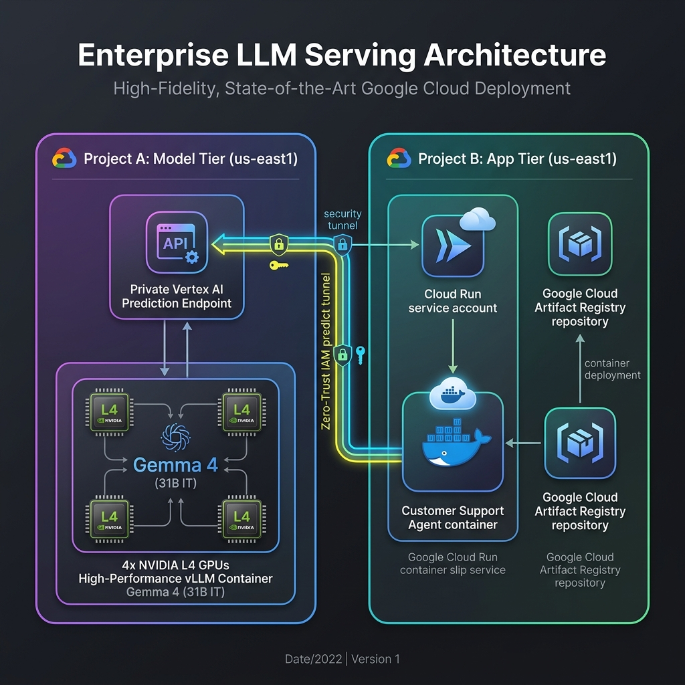
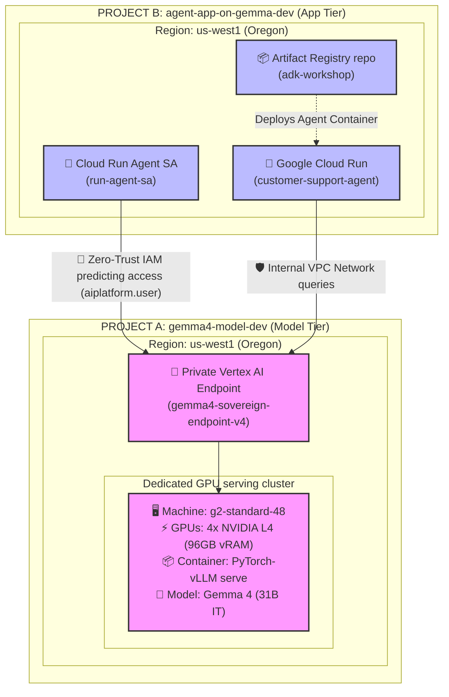

# 🚀 Running and Testing the Multi-Agent POC

This guide walks you through running the customer support multi-agent system in both **CLI Mode** and **Interactive Web UI Mode** using your configured environment.

---

## 📋 Prerequisites

Ensure your virtual environment is activated and dependencies are loaded:
```bash
# 1. Activate the Python 3.13 virtual environment
source .venv/bin/activate

# 2. Confirm your environment variables are configured
# Your .env file has been pre-populated with your Argolis project ID:
# GOOGLE_CLOUD_PROJECT=poc-gemma4-496922
# GOOGLE_GENAI_USE_VERTEXAI=False (Gemma 4 runs via Google AI Studio API)
```

---

## 💻 1. Running CLI Mode (`adk run`)

The ADK CLI allows you to execute single-step queries directly from your terminal. It will initialize the `triage_agent`, route your query using the `gemma-4-31b-it` model, and perform the appropriate agent transfer:

```bash
# Test Billing Routing
adk run customer_support "I was charged twice this month, can you help?"

# Test Technical Troubleshooting Routing
adk run customer_support "I am getting a 500 error when calling your API"

# Test General Support Routing
adk run customer_support "How do I reset my password?"
```

You should see the decision trace from `[triage_agent]` ending in a structured JSON transfer command, e.g.:
```json
{"name": "transfer_to_agent", "parameters": {"agent_name": "billing_agent"}}
```

---

## 🌐 2. Running Interactive Web UI (`adk web`)

The ADK Web UI provides a premium, rich-featured interface to chat with your agents, create evaluation datasets, and visualize execution traces and logic graphs.

### Start the Web Server
Run the web server by pointing ADK to your current workspace folder (which contains `customer_support` as a subdirectory):

```bash
# Start the web server on default port 8000
adk web .
```

*If you want to run on a custom port (e.g., 8080) or enable debug logs:*
```bash
adk web . --port 8080 --verbose
```

### How to Test in the Browser
1. Open your browser and navigate to: **[http://127.0.0.1:8000](http://127.0.0.1:8000)**
2. In the top-left dropdown, select the **`triage_agent`**.
3. Type any of the sample queries in the chat window.
4. **Explore the Trace View**:
   * Click on the **Trace** tab in the UI.
   * Inspect execution flows, request/response structures, and generated routing events.
   * Inspect the blue-highlighted event rows that represent ADK agent-to-agent transfers.

---

## ☁️ 3. Live Cross-Project GCP Sandbox Deployment

For the **Management AI Week Workshop**, follow this production-grade deployment guide to privately host the **Gemma 4 Inference Model** in one secure GCP sandbox project, and the **ADK Application Orchestrator** in another project.

### 📐 Multi-Project Zero-Trust Architecture Diagram



<details>
<summary>💻 Click to expand raw editable Mermaid configuration code</summary>


</details>

---

### 🗂️ Step 3.1: Active CLI Session Setup
Ensure you are authenticated inside your GCP Argolis sandbox and configure your active terminal variables with your exact Project IDs:

```bash
# 1. Authenticate with Google Cloud SDK and Application Default Credentials (ADC)
# (gcloud auth login sets up the CLI. application-default login enables the Python client libraries to authenticate).
gcloud auth login
gcloud auth application-default login

# 2. Configure project variables (GCP project IDs cannot contain spaces!)
export MODEL_PROJECT_ID="gemma4-model-dev"
export APP_PROJECT_ID="agent-app-on-gemma-dev"

# 3. Verify that both sandboxes are reachable
gcloud projects describe $MODEL_PROJECT_ID
gcloud projects describe $APP_PROJECT_ID
```

### 🛠️ Sovereign Infrastructure-as-Code Deployment (Terraform)

This is the standard enterprise-grade deployment workflow. It completely automates the API enablement, service account creation, cross-project permission grants, VPC endpoints, and private model container registry provisioning.

Tearing down the entire stack is equally instant, preventing any resource or billing leaks!


#### Step 3.2: Initialize the Terraform directory
The configuration is modularly built inside the **[terraform/](file:///Users/warunk/Desktop/git/adk-multi-agent-gemma4/terraform)** folder.

```bash
# Navigate to your Terraform directory
cd terraform

# Initialize providers (Google Cloud & Null lifecycle binders)
terraform init
```

#### Step 3.3: Deploy the entire stack
Launch deployment. The variables are pre-loaded with your Project IDs. 
*Note: Gemma 31B IT unquantized loads on a 4-card NVIDIA L4 cluster by default (`g2-standard-48` machine).*

```bash
# Preview deployment blueprint plan
terraform plan

# Deploy model, VPC prediction endpoints, and IAM bindings!
# (Type 'yes' to confirm when prompted)
terraform apply
```

> [!IMPORTANT]
> **Terraform Lifecycle Hand-off Note (If Endpoint Already Exists):**
> In Terraform, custom scripts (`local-exec` provisioner blocks) are **creation-time provisioners**—they only run once during the very first deployment that creates the resource.
> If the `google_vertex_ai_endpoint` was successfully created on a prior run (even if the container deployment step failed, timed out, or was empty), subsequent `terraform apply` runs will report `No changes` and **skip model deployment**.
>
> If your endpoint exists but does not have the custom model container active, resolve this using one of the following methods:
> 
> * **Method A: Manual CLI Trigger (Recommended & Fastest)**
>   Register the Model Garden verified model spec and deploy the cluster manually to your active endpoint:
>   ```bash
>   # 1. Register the validated model spec (using Model Garden's verified PyTorch vLLM container)
>   NEW_MODEL_ID=$(gcloud ai models upload \
>     --project=gemma4-model-dev \
>     --region=us-west1 \
>     --display-name="gemma-4-31b-it-vllm" \
>     --container-args="python,-m,vllm.entrypoints.api_server,--host=0.0.0.0,--port=8080,--model=gs://vertex-model-garden-restricted-us/gemma4/gemma-4-31B-it,--tensor-parallel-size=4,--max-model-len=32768,--max-num-seqs=128,--gpu-memory-utilization=0.9,--limit-mm-per-prompt.image=4,--limit-mm-per-prompt.video=1,--enable-auto-tool-choice,--tool-call-parser=gemma4,--reasoning-parser=gemma4" \
>     --container-health-route="/ping" \
>     --container-predict-route="/generate" \
>     --container-ports=8080 \
>     --container-shared-memory-size-mb=65536 \
>     --format="value(model)")
> 
>   # 2. Deploy the validated model cluster to your active private endpoint
>   gcloud ai endpoints deploy-model projects/gemma4-model-dev/locations/us-west1/endpoints/gemma4-sovereign-endpoint-v4 \
>     --project=gemma4-model-dev \
>     --region=us-west1 \
>     --model=$NEW_MODEL_ID \
>     --display-name="gemma-4-31b-it-deployed" \
>     --machine-type=g2-standard-48 \
>     --accelerator=type=nvidia-l4,count=4 \
>     --min-replica-count=1 \
>     --max-replica-count=1 \
>     --traffic-split=0=100
>   ```
> * **Method B: Force Re-Creation (Clean Slate)**
>   Taint the endpoint in Terraform so it is destroyed and recreated on next run:
>   ```bash
>   terraform taint google_vertex_ai_endpoint.gemma_endpoint
>   terraform apply
>   ```

Once done, Terraform outputs a visual **🔌 Sovereign ADK Environment Configuration Helper**:

```text
================================================================================
🔌 sovereign ADK Environment Configuration Helper:
================================================================================
Copy these settings directly into your customer_support/.env file:
...
```

#### Step 3.4: Package & Deploy Agent to Cloud Run
Once the model is active, compile and deploy your agent container to the provisioned repository.

1. **Verify your active CLI session has variables loaded**:
   ```bash
   export APP_PROJECT_ID="agent-app-on-gemma-dev"
   export MODEL_PROJECT_ID="gemma4-model-dev"
   ```

2. **Navigate back to the workspace root**:
   ```bash
   cd ..
   ```

3. **Build image and push to Artifact Registry in Project B**:
   ```bash
   gcloud builds submit --tag us-west1-docker.pkg.dev/$APP_PROJECT_ID/adk-workshop/customer-support:v1 . --project=$APP_PROJECT_ID
   ```

4. **Deploy the Service to Google Cloud Run**:
   We pass the dynamic `GEMMA_MODEL` pointer direct in `--set-env-vars`, so no manual code edits are required in `customer_support/config.py`!
   ```bash
   gcloud run deploy customer-support-agent \
     --image=us-west1-docker.pkg.dev/$APP_PROJECT_ID/adk-workshop/customer-support:v1 \
     --service-account=run-agent-sa@$APP_PROJECT_ID.iam.gserviceaccount.com \
     --region=us-west1 \
     --project=$APP_PROJECT_ID \
     --set-env-vars="GOOGLE_CLOUD_PROJECT=gemma4-model-dev,GOOGLE_CLOUD_LOCATION=us-west1,GOOGLE_GENAI_USE_VERTEXAI=True,GEMMA_MODEL=projects/gemma4-model-dev/locations/us-west1/endpoints/gemma4-sovereign-endpoint-v4"
   ```

#### Step 3.5: Sovereign Teardown (Clean up sandbox after workshop)
To destroy all created resources instantly, run from your `terraform/` directory:

```bash
# Tethers out of the endpoints, deletes registered models, SAs, and endpoints instantly!
terraform destroy
```

---

### 🔌 Step 3.6: Hook Up the Sovereign Model Endpoint (Local Testing Mode)

Since [customer_support/config.py](file:///Users/warunk/Desktop/git/adk-multi-agent-gemma4/customer_support/config.py) is refactored to read from environment variables dynamically (`os.getenv("GEMMA_MODEL")`), you can swap between standard AI Studio and Vertex AI mode locally without modifying any source files.

To run local testing against your new private sovereign model:

1. Configure your application runtime [.env](file:///Users/warunk/Desktop/git/adk-multi-agent-gemma4/.env) file:
   ```env
   GOOGLE_CLOUD_PROJECT=gemma4-model-dev
   GOOGLE_CLOUD_LOCATION=us-west1
   GOOGLE_GENAI_USE_VERTEXAI=True
   GEMMA_MODEL=projects/gemma4-model-dev/locations/us-west1/endpoints/gemma4-sovereign-endpoint-v4
   ```

2. Run local verification:
   ```bash
   ./.venv/bin/adk run customer_support "I was charged twice this month, can you help?"
   ```
   All multi-agent coordination, document parsing, and routing predictions will now securely travel through your zero-trust cross-project private VPC endpoint!

---

## 🔍 4. Sovereign Verification & Debugging Toolbelt

Use these verified, production-grade `gcloud` commands directly in your active terminal to monitor GPU cluster health, discover Model Garden images, inspect local registry bindings, and troubleshoot deployment logs.

### ⚡ Category A: Checking Regional GPU Quotas
Before triggering high-cost GPU clusters, verify that your regional sandbox projects have physical quota allocated and see active usage footprints:

```bash
# Check physical NVIDIA L4 regional GPU limit and active usage
gcloud compute regions describe us-west1 \
  --project=$MODEL_PROJECT_ID \
  --format="value(quotas)" | grep NVIDIA_L4
```

### 🧠 Category B: Model Garden Discovery & Telemetry
Large language models (like Gemma 4) use pre-configured, optimized, and security-hardened serving containers. Query the official publisher metadata directly to inspect verified configurations:

```bash
# 1. Discover and list all verified publisher models under the Gemma family
gcloud ai model-garden models list \
  --model-filter=gemma \
  --project=$MODEL_PROJECT_ID \
  --billing-project=$MODEL_PROJECT_ID

# 2. Extract verified deployment configurations for Gemma 4
# (Lists all certified VM sizes, GPU types, and optimized PyTorch serving container images)
gcloud ai model-garden models list-deployment-config \
  --model=google/gemma4@gemma-4-31b-it \
  --project=$MODEL_PROJECT_ID \
  --billing-project=$MODEL_PROJECT_ID
```

### 🖥️ Category C: Monitoring Model Registry & Endpoint State
Track your private assets as they are established under your sovereign boundary control:

```bash
# 1. List all custom uploaded model config IDs in the region
gcloud ai models list \
  --project=$MODEL_PROJECT_ID \
  --region=$REGION

# 2. Retrieve detailed container parameters of a specific uploaded model
gcloud ai models describe YOUR_MODEL_ID \
  --project=$MODEL_PROJECT_ID \
  --region=$REGION

# 3. Retrieve live Endpoint status and list fully deployed active model nodes
gcloud ai endpoints describe gemma4-sovereign-endpoint-v4 \
  --project=$MODEL_PROJECT_ID \
  --region=$REGION \
  --format=json
```

### 🔄 Category D: Discovering & Monitoring Active Deployment Operations
Model serving containers require GPU server node allocation which runs asynchronously on Google Cloud. 

Because Terraform's `local-exec` stdout is suppressed (to protect sensitive configuration variables like tokens), standard operation ID prints are hidden. However, every single deployment action is automatically captured in **Google Cloud Audit Activity Logs**.

You can programmatically discover your active deployment Operation ID, and check its progress, using these commands:

```bash
# 1. Query the Audit Activity Logs to extract the latest 'DeployModel' Operation ID path
gcloud logging read "protoPayload.serviceName=\"aiplatform.googleapis.com\" AND protoPayload.methodName:\"DeployModel\"" \
  --project=$MODEL_PROJECT_ID \
  --limit=1 \
  --format="value(operation.id)"

# 2. Track active serving cluster creation progress (e.g., CREATING_SERVING_CLUSTER)
# Substitute 'YOUR_OPERATION_ID' (the numerical ID extracted from the step above)
gcloud ai operations describe YOUR_OPERATION_ID \
  --project=$MODEL_PROJECT_ID \
  --region=$REGION
```
